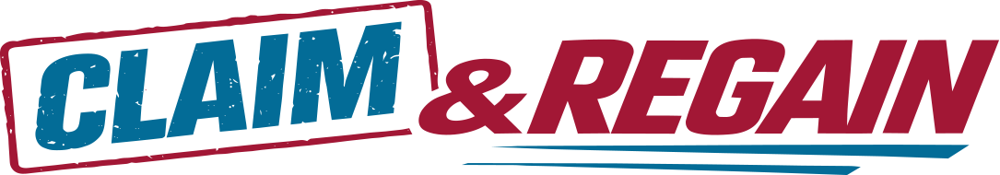
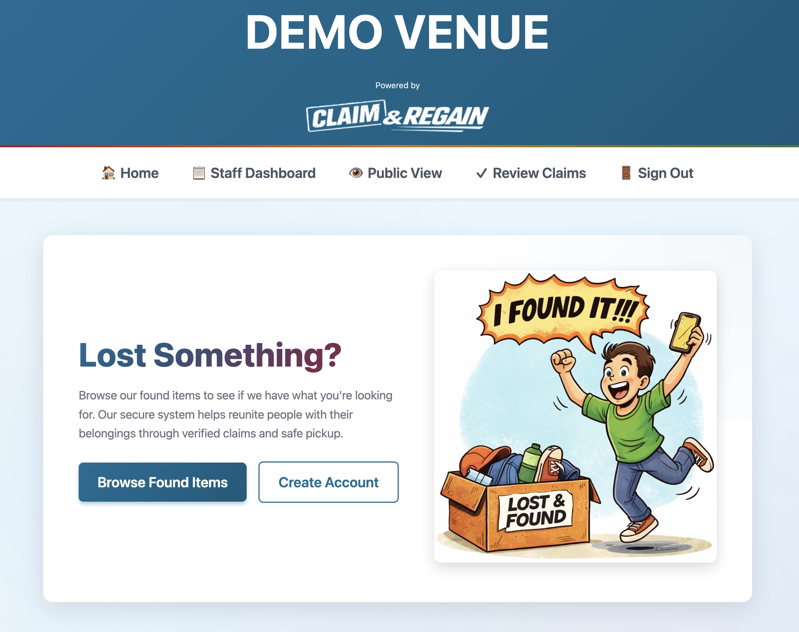

# Claim & Regain

A lost & found tracking system for high-traffic spaces like schools, gyms, and event venues. Claim & Regain helps venues safely track lost property and return items to their rightful owners through a verification-based claiming process.

## Description

Claim & Regain solves the problem of managing lost items in busy venues where theft and false claims are concerns. Staff can log found items with private verification questions, while visitors browse vague public listings and prove ownership by answering specific questions. This prevents theft while ensuring legitimate owners can reclaim their belongings.

## Getting Started

**Deployed App:** https://claim-and-regain.netlify.app/

**Planning Materials:**
- [Wireframes, ERD, User Stories](https://trello.com/b/G2JJzkQW/claim-regain)

**Backend Repository:** https://github.com/veggiebyte/claim-regain-backend

**Test Accounts:**
- Staff: username: `cindy` / password: `cindys`
- Visitor: username: `visitor2` / password: `visitor2`

## Attributions

- Images: Generate with Firefly (cartoon images and found items), also Deposit Photos

## Technologies Used

- **Frontend:** React, React Router, CSS3
- **Backend:** Node.js, Express, MongoDB, Mongoose
- **Authentication:** JWT (JSON Web Tokens), bcrypt
- **Deployment:** Netlify (frontend), Heroku (backend)

## Next Steps

Planned future enhancements:

- [ ] Direct image uploads (currently using placeholder URLs)
- [ ] Multiple photo attachments per item
- [ ] QR code generation for physical item tags
- [ ] Automatic donation eligibility after holding period (30 days)
- [ ] Email notifications for claim status updates
- [ ] SMS notifications for approved claims
- [ ] Advanced search filters (date ranges, multiple categories)
